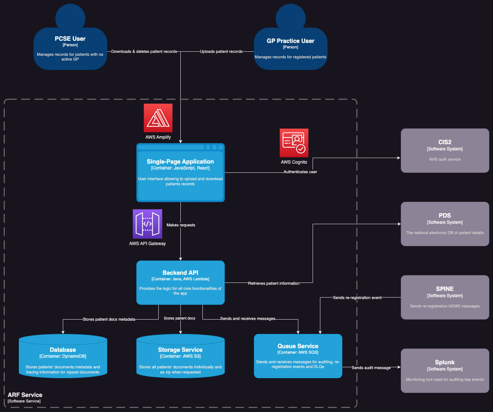

# Container

The container diagram below illustrates the technical building blocks of the ARF service.

The diagram assumes that all services are healthy; the user is logged in; and has the required
permissions to use the system.

[//]: # (TODO: Replace this image with Mermaid once C4 models are fully supported.)

