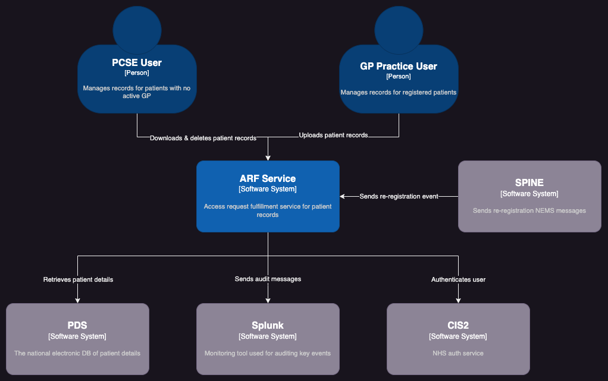

# System Context

The system context diagram below illustrates how the ARF service interacts from a high-level.

The diagram assumes that all services are healthy; the user is logged in; and has the required
permissions to use the system.

[//]: # (TODO: Replace this image with Mermaid once C4 models are fully supported.)

