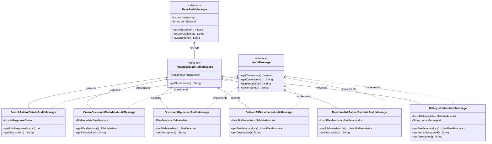

# Audit Messages

The class diagram below illustrates the structure of the audit messages via their classes, fields, methods, and
relationships.

```mermaid
classDiagram
    class AuditMessage{
        <<interface>>
        +getTimestamp() Instant
        +getCorrelationId() String
        +getDescription() String
        +toJsonString() String
    }
    class BaseAuditMessage{
        <<abstract>>
        -Instant timestamp
        -String correlationId
        +getTimestamp() Instant
        +getCorrelationId() String
        +toJsonString() String
    }
    class PatientRelatedAuditMessage{
        <<abstract>>
        -NhsNumber nhsNumber
        +getNhsNumber() String
    }
    class SearchPatientDetailsAuditMessage{
        -int pdsResponseStatus
        +getPdsResponseStatus() int
        +getDescription() String
    }
    class CreateDocumentMetadataAuditMessage{
        -FileMetadata fileMetadata
        +getFileMetadata() FileMetadata
        +getDescription() String
    }
    class DocumentUploadedAuditMessage{
        -FileMetadata fileMetadata
        +getFileMetadata() FileMetadata
        +getDescription() String
    }
    class DeletedAllDocumentsAuditMessage{
        -List~FileMetadata~ fileMetadataList
        +getFileMetadataList() List~FileMetadata~ 
        +getDescription() String
    }
    class DownloadAllPatientRecordsAuditMessage{
        -List~FileMetadata~ fileMetadataList
        +getFileMetadataList() List~FileMetadata~ 
        +getDescription() String
    }
    class ReRegistrationAuditMessage{
        -List~FileMetadata~ fileMetadataList
        -String nemsMessageId
        +getFileMetadataList() List~FileMetadata~ 
        +getNemsMessageId() String 
        +getDescription() String
    }
    BaseAuditMessage <-- PatientRelatedAuditMessage: extends
    PatientRelatedAuditMessage <-- SearchPatientDetailsAuditMessage: extends
    PatientRelatedAuditMessage <-- CreateDocumentMetadataAuditMessage: extends
    PatientRelatedAuditMessage <-- DocumentUploadedAuditMessage: extends
    PatientRelatedAuditMessage <-- DeletedAllDocumentsAuditMessage: extends
    PatientRelatedAuditMessage <-- DownloadAllPatientRecordsAuditMessage: extends
    PatientRelatedAuditMessage <-- ReRegistrationAuditMessage: extends
    AuditMessage <.. SearchPatientDetailsAuditMessage: implements
    AuditMessage <.. CreateDocumentMetadataAuditMessage: implements
    AuditMessage <.. DocumentUploadedAuditMessage: implements
    AuditMessage <.. DeletedAllDocumentsAuditMessage: implements
    AuditMessage <.. DownloadAllPatientRecordsAuditMessage: implements
    AuditMessage <.. ReRegistrationAuditMessage: implements
```
