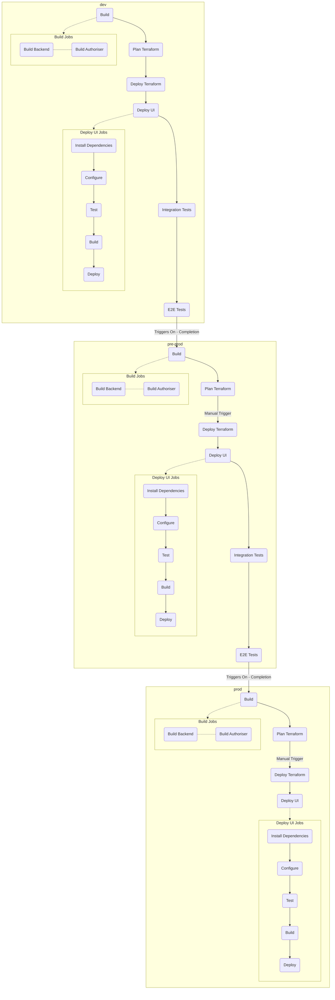

# Path To `prod`

The diagrams below illustrate a segment of our software dev lifecycle from different perspectives. For more details,
please see
the [Definition Of Done](https://gpitbjss.atlassian.net/wiki/spaces/TW/pages/12314869771/Definition+of+done+ARF).

## Story Lifecycle

The diagram below illustrates each stage of a typical story's lifecycle until the story has been moved into the Done
column on the Kanban board.

_Note: All deployment steps (incl. during dev) are dependent pipeline being green at the time._

## CI

The diagram below illustrates each stage of the CI pipeline including any automatic/manual triggers.

