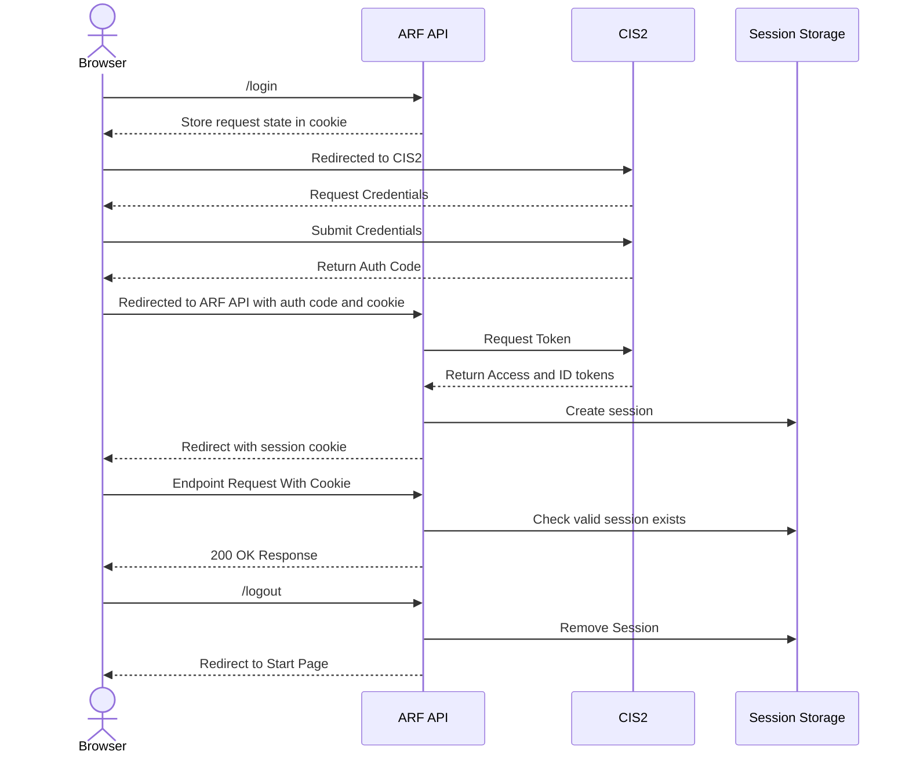
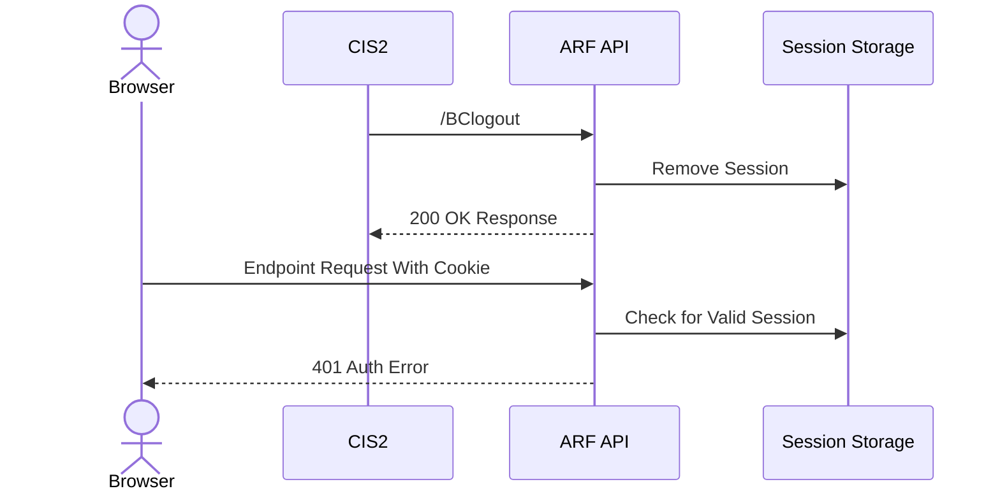

# Auth (CIS2)

The sequence diagram below illustrate the interactions that occur when a user logs into the app.

The diagram assumes that AWS Amplify has served the React web app (where the sequence begins) and the user has valid
CIS2 login details.

_Note: This diagram does not include interactions with CloudWatch._

The proposal for a new auth flow will look like this:

The Back-Channel Logout will allow CIS2 to request the removal of an ongoing session:

