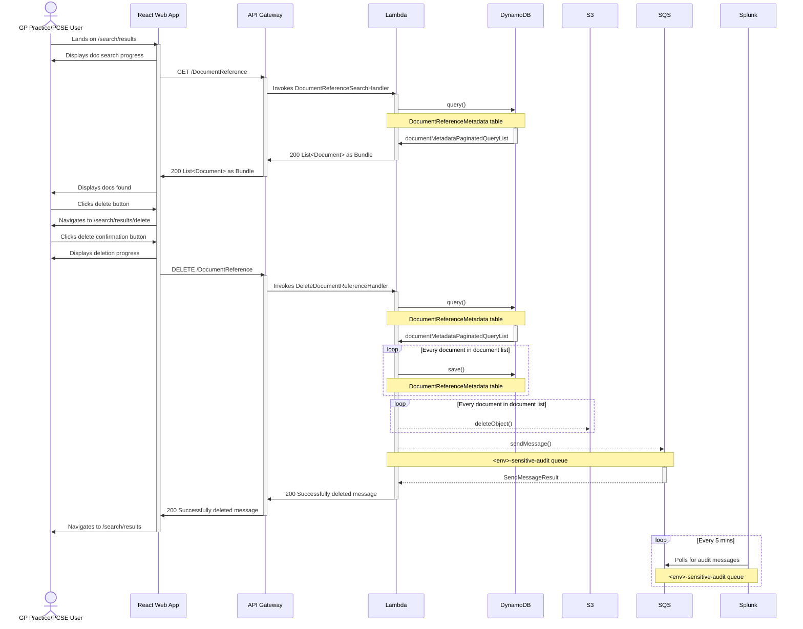

# Delete Docs

The sequence diagram below illustrate the interactions that occur when a user deletes all docs.

The diagram assumes that AWS Amplify has served the React web app; the user is logged in; has the required
permissions to delete docs; and has found the patient, with docs uploaded, that they want to delete docs for (where the
sequence begins).

_Note: This diagram does not include interactions with CloudWatch._

