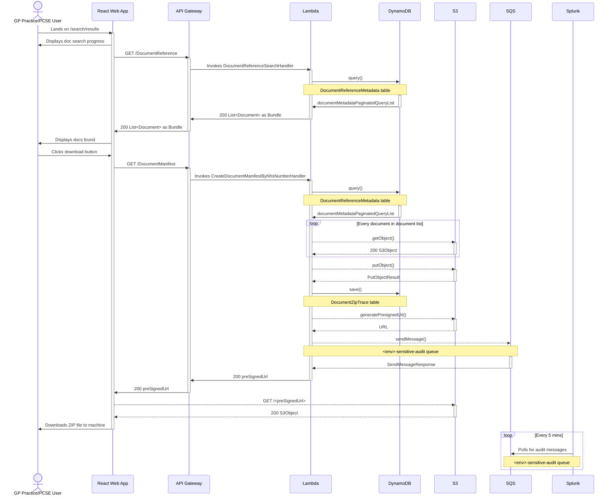

# Download Docs

The sequence diagram below illustrate the interactions that occur when a user downloads docs.

The diagram assumes that AWS Amplify has served the React web app; the user is logged in; has the required
permissions to download docs; and has found the patient they want to download docs for (where the sequence begins).

