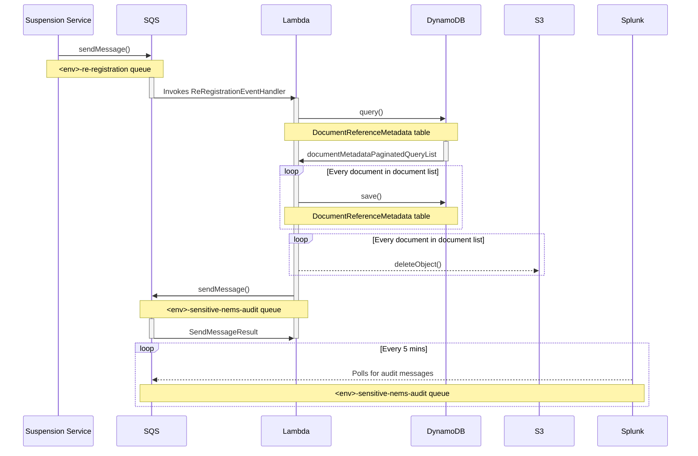

# Re-Registration Event

The sequence diagram below illustrate the interactions that occur when a patient registers at a practice after having
been suspended.

The diagram assumes that the patient was successfully re-registered; a NEMS message was created for that re-registration
and made available to the Suspension Service through the MESH mailbox; Suspension Service successfully delivered the
re-registration event to ARF re-registration SQS queue (where the sequence begins); finally, some documents were
uploaded in the ARF service for that patient.

_Note: This diagram does not include interactions with CloudWatch._

