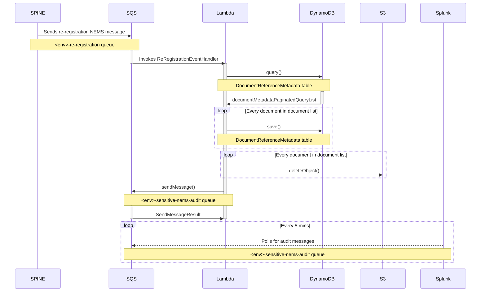

# Re-Registration Event

The sequence diagram below illustrate the interactions that occur when a patient registers at a practice after having
been suspended.

The diagram assumes that a patient, with uploaded documents, has re-registered and a NEMS message was published
through the MESH mailbox. Then, the re-registration event has been sent to the ARF re-registration SQS queue (where the
sequence begins).

_Note: The MESH mailbox is owned by the ORC team._
_Note: This diagram does not include interactions with CloudWatch._

