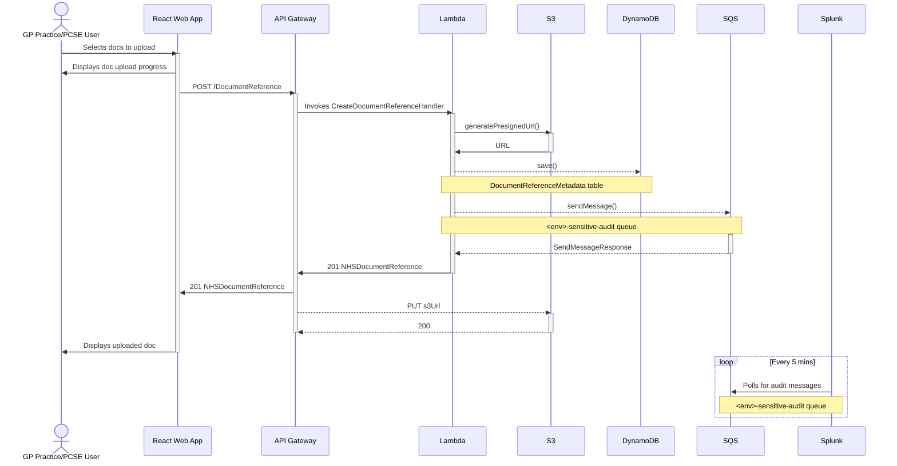

# Upload Docs

The sequence diagram below illustrate the interactions that occur when a user uploads docs.

The diagram assumes that AWS Amplify has served the React web app; the user is logged in; has the required
permissions to upload docs; and has found the patient they want to upload docs for (where the sequence begins).

