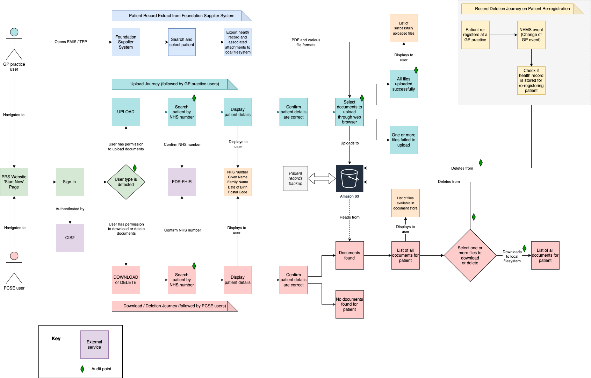
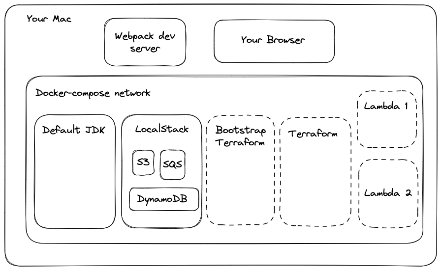

# Local Dev Env

This doc describes how the local dev env functions, as opposed to how to operate it (see
[README](../README.md) for that). The user journey architecture diagram below, will be a useful starting point:

## What Happens When Running `./tasks start-localstack`?

The `tasks` file is a Bash script containing most of the command required to provision and manage the app,
including starting the app, building the project, and provisioning AWS resources. It is used in both local and cloud
situations.

The `start-localstack` task invokes a program called [Dojo](https://github.com/kudulab/dojo), which is a wrapper around
Docker built by a Thoughtworker. Dojo provides several benefits including ensuring containers handle termination signals
properly, configuring Docker users correctly and forwarding env vars into the containers.

The dojo command does a couple of things. First, it generates a `docker-compose.yaml.dojo` file which specifies a
default container based on the image specified in `Dojofile-integration`, and environment variables and volumes for the
other containers specified in the main `docker-compose.yml`. Secondly, it runs `docker-compose` with the `-f` flag to
merge the config from `docker-compose.yml` and `docker-compose.yaml.dojo`. Neither of the YAML files is a valid docker
compose file in its own right; only when merged together in a single docker compose command can the project run.

## What Does Docker Compose?

The first container docker-compose starts is the [LocalStack](https://localstack.cloud/) container, which provides local
versions of many AWS services. This takes a few seconds to become healthy, so we have the next
container `bootstrap-terraform` wait for a "healthy" signal from
LocalStack, as it can't run until LocalStack has made instances of AWS S3 and DynamoDB available.
The `bootstrap-terraform` container is an AWS CLI container which runs our`bootstrap-terraform.sh` script. This script
is responsible for creating an S3 bucket and a
DynamoDB table to store the terraform state for our local dev env in. These need to be recreated every
time we start the project, because LocalStack's community edition does not persist its state in a volume.

Once `bootstrap-terraform` has completed successfully, we start the Terraform container. This container runs
the `deploy-to-localstack.sh` script, which plans and applies the Terraform using the local Terraform backend created
by `bootstrap-terraform.sh` and the local Terraform vars in `local.tfvars`. Again, the AWS resources provisioned
are not maintained once the LocalStack container exits (i.e. once the docker compose command stops running).

Finally, once Terraform has finished, we start the `default` container, which is actually just an OpenJDK container with
a few modifications to allow it to work with
Dojo. [This is the image repository](https://github.com/nhsconnect/prm-deductions-docker-openjdk-dojo). Dojo
automatically creates a terminal session inside the default container so that you can do stuff like compile the Java
app or run tests from inside the Docker network. Exiting the terminal session brings down the local env
and wipes the LocalStack state.

At this point, we have a Docker network running that looks like this (dashed lines indicate ephemeral containers that
only run for the duration of their entrypoint script):

You'll have noticed that there are several elements we haven't covered yet in that diagram. Let's take a look at those.

## What's Going On With Lambdas?

LocalStack runs Lambdas in a different way from other AWS services, which usually run inside the LocalStack image and
are routed internally. Lambdas, however, are run from outside the LocalStack container within our existing
docker-compose network. LocalStack is able to do this because we bind the Docker daemon on our host machine to a
location within the LocalStack container, allowing LocalStack to call our system Docker. We do this by specifying a
volume in our `docker-compose.yml` for `/var/run/docker.sock`. Because the Lambdas are part of our main docker-compose
network, they can call out to other containers in our stack. They can also call other LocalStack services through AWS
SDKs as long as the SDKs are configured so that they think AWS exists at http://localhost:4566.

LocalStack has multiple [Lambda execution modes](https://docs.localstack.cloud/references/lambda-executors/) which are
worth reading up about. We prefer the "docker-reuse" mode to minimise cold starts during development.

Before we can execute a Lambda, we need to build the JAR file for the Java project and deploy it via Terraform. Remember
that every time you change some Java code, you need to rebuild the JAR and re-apply your Terraform before those changes
will be reflected by Lambda.

_Note: Because each Lambda runs inside its own container you will not see log
output from your Java code inside the LocalStack container's logs. You will need to access the Lambda container's logs
instead._

## What About The Client App?

In the cloud, the web app runs on AWS Amplify, but this is one of the AWS services that LocalStack does not
provide. Fortunately, the app template we are using, [Create React App](https://create-react-app.dev/), comes with the
venerable `webpack-dev-server` module included. Therefore, we can serve the web app over a local port instead.
LocalStack's port `4566` is bound to your host machine, so requests can be made from your browser to LocalStack. This
also
enables you to interact with LocalStack via your host machine's terminal or any other programs, but be wary of doing so
as differences between your envs (e.g. having a different version of Terraform available) may cause problems.

## LocalStack Seems To Be Quite Important, Anything Else I Should Know?

Yes. Whilst LocalStack is a brilliant project and offers pretty good representations of many AWS services, it does have
some limitations. Here are a few that we've encountered so far relevant to this project:

- There's no implementation of Cognito, SSM Parameter Store or AWS Amplify.
- IAM permission checks are not applied, so policies cannot be tested locally.
- API Gateway does not apply auth checks.

We have found a number of ways to working around these issues for local dev.

| Issue                                  | Workaround                                                      |
|----------------------------------------|-----------------------------------------------------------------|
| Missing AWS Cognito                    | Use `dev` env Cognito with local                                |
| Missing AWS Amplify                    | Use `webpack-dev-server` in local env                           |
| Missing Parameter Store                | Use Terraform vars where possible, fake local secrets where not |
| Missing IAM Permissions Checks         | We can only test policies in cloud envs                         |
| API Gateway Does Not Apply Auth Checks | Unit test the authoriser and test in the `dev` env              |

The other impact of the limitations of LocalStack is that we have to reflect this in our Terraform code. Unfortunately,
Terraform is not intended to conditionally alter infra in different envs. Currently, we are working
around this through use of the `count` meta-property on resources that are not available in LocalStack, but it does make
Terraform code hard to reason about. We may consider splitting our cloud and local Terraform projects and sharing code
using modules.

## How Do I Know If I've Broken Anything?

[//]: # (TODO: Add info on how to diagnose if anything is broken.)
Coming soon...
