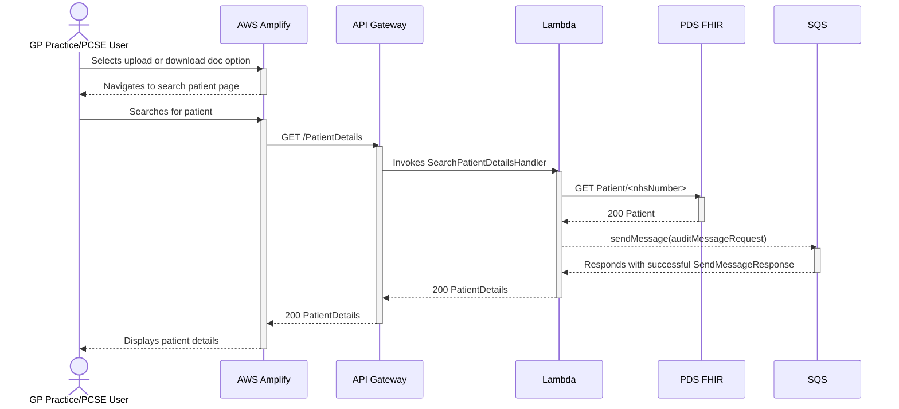

# Search Patient Details

The sequence diagram below illustrates the interactions that occur when a user searches for a patient.

This diagram assumes that the user is logged in and has the required permissions to search for a valid NHS number.

