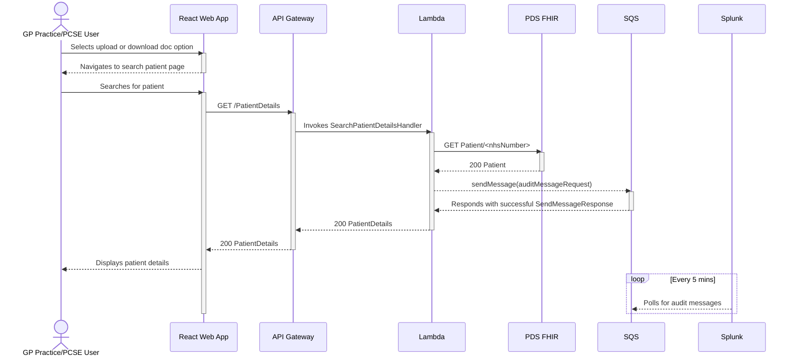

# Search Patient Details

The sequence diagram below illustrates the interactions that occur when a user searches for a patient.

This diagram assumes that AWS Amplify has served the React web app; the user is logged in; and has the required
permissions to search for a valid NHS number.

