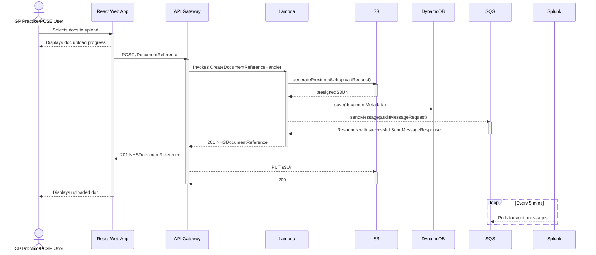

# Document Upload

The sequence diagrams below illustrate the interactions that occur when a user uploads a doc that produces a positive
result when scanned for a virus.

The diagrams assume that AWS Amplify has served the React web app; the user is logged in; and has the required
permissions to upload a doc (where the sequences begin).

## Without Virus Scanning (As-Is)

## With Virus Scanning (To-Be)

**🚧 TODO: Add virus scanning implementation to diagram 🚧**

