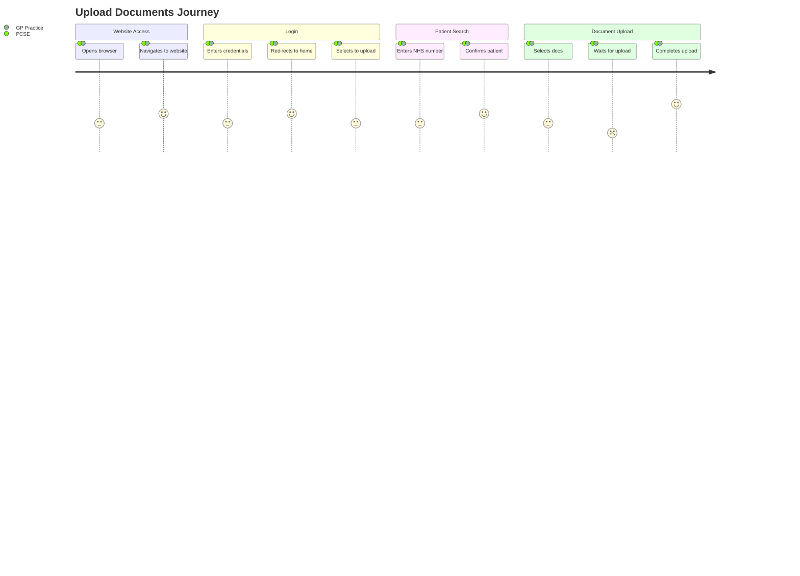

# Upload Documents

The user journey diagram below illustrates the journey that the user goes through when uploading documents.

This diagram assumes that has the required permissions to search for a valid NHS number and upload documents.

